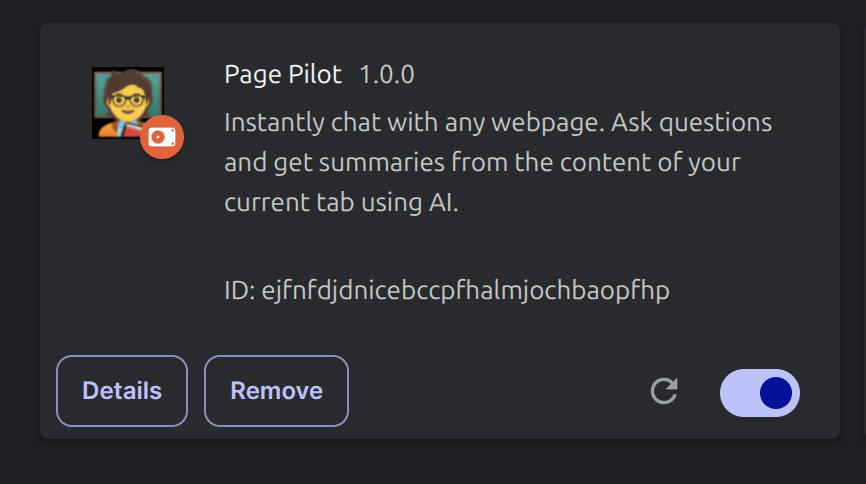
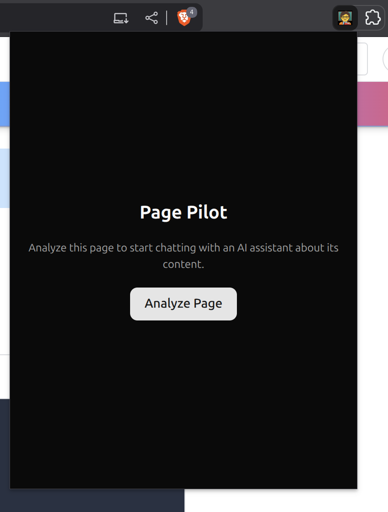
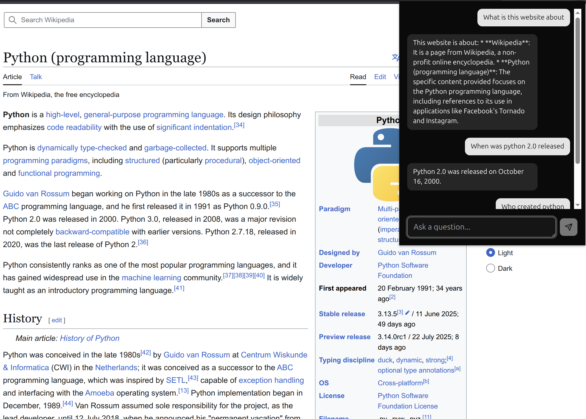

# Page Pilot

Page Pilot is a powerful Chrome extension that allows you to instantly chat with any webpage. Ask questions, get summaries, and find information in the content of your current tab using a sophisticated AI-powered RAG (Retrieval-Augmented Generation) pipeline.

## Screenshots

<p align="center">
  
  
  
</p>

## Features

-   **Webpage Analysis:** Analyze the content of any webpage with a single click.
-   **AI-Powered Chat:** Chat with an AI assistant that has knowledge of the webpage's content.
-   **Data Management:** Clear the analyzed data for a specific URL when it's no longer needed.
-   **Seamless Integration:** Works as a Chrome extension for easy access while browsing.

## Tech Stack

### Frontend

-   **React:** A JavaScript library for building user interfaces.
-   **TypeScript:** A typed superset of JavaScript that compiles to plain JavaScript.
-   **Vite:** A fast build tool and development server for modern web projects.
-   **Tailwind CSS:** A utility-first CSS framework for rapid UI development.
-   **Shadcn/ui:** A collection of reusable UI components.

### Backend

-   **FastAPI:** A modern, fast (high-performance) web framework for building APIs with Python 3.7+.
-   **LangChain:** A framework for developing applications powered by language models.
-   **Pinecone:** A vector database for storing and retrieving high-dimensional vector embeddings.
-   **Nomic:** A tool for embedding and visualizing large datasets.
-   **Crawl4AI:** A library for crawling and scraping webpages.

## Installation and Setup

To get started with Page Pilot, follow these steps:

### Prerequisites

-   Node.js and npm (for the frontend)
-   Python 3.7+ and pip (for the backend)
-   A Pinecone account and API key
-   A Nomic account and API key
-   A Gemini API key

### 1. Clone the Repository

```bash
git clone https://github.com/your-username/page-pilot.git
cd page-pilot
```

### 2. Set Up the Backend

1.  **Navigate to the backend directory:**

    ```bash
    cd backend
    ```

2.  **Create a virtual environment and activate it:**

    ```bash
    python -m venv venv
    source venv/bin/activate
    ```

3.  **Install the required Python packages:**

    ```bash
    pip install -r requirements.txt
    ```

4.  **Create a `.env` file and add your API keys:**

    ```env
    PINECONE_API_KEY="your-pinecone-api-key"
    NOMIC_EMBEDDINGS_API_KEY="your-nomic-api-key"
    GEMINI_API_KEY="your-gemini-api-key"
    ```

5.  **Run the backend server:**

    ```bash
    uvicorn main:app --reload
    ```

### 3. Set Up the Frontend

1.  **Navigate to the frontend directory:**

    ```bash
    cd ../frontend
    ```

2.  **Install the required npm packages:**

    ```bash
    npm install
    ```

3.  **Run the frontend development server:**

    ```bash
    npm run dev
    ```

### 4. Load the Extension in Chrome

1.  Open Chrome and navigate to `chrome://extensions`.
2.  Enable "Developer mode" in the top right corner.
3.  Click "Load unpacked" and select the `frontend/dist` directory.

## API Endpoints

The backend provides the following API endpoints:

-   `GET /`: Returns a "Server is alive!" message.
-   `POST /analyze`: Analyzes a webpage and creates a RAG pipeline.
-   `POST /chat`: Chats with the RAG pipeline.
-   `DELETE /clear`: Clears the data for a specific URL.

## Usage

1.  Navigate to any webpage you want to analyze.
2.  Click the Page Pilot extension icon in your Chrome toolbar.
3.  Click the "Analyze Page" button to process the content.
4.  Once the analysis is complete, you can start chatting with the AI assistant about the webpage.

## Project Structure

```
.
├── backend/
│   ├── main.py
│   └── rag_pipeline.py
└── frontend/
    ├── src/
    │   ├── App.tsx
    │   ├── components/
    │   └── hooks/
    └── public/
```

## Contributing

Contributions are welcome! If you have any ideas, suggestions, or bug reports, please open an issue or submit a pull request.
